# Bifrost Monday-to-Figma Automation Plan

## Outcome

Ship a dedicated `bifrost` foundation that listens to Monday status transitions (e.g. `Figma Ready`) and automatically materializes a Figma experiment page/variants using your existing briefing schema, naming rules, and template conventions.

## Scope For V1

- Primary trigger: Monday status change (`Figma Ready`) on the experiment board.
- Primary action: create/fill Figma template content from Monday fields + structured variant blocks.
- Secondary fallback: a Figma plugin command to run/re-run filling for a selected experiment if automation misses or needs manual retry.
- Backend location: new Bifrost repo only.

## Reuse From Existing Loop-Vesper Code

- Reuse event/contracts shape from [C:/Users/buyss/Dropbox/03_Thoughtform/08_Artifacts/07_vesper.loop/Loop-Vesper/src/lib/sync/contracts.ts](C:/Users/buyss/Dropbox/03_Thoughtform/08_Artifacts/07_vesper.loop/Loop-Vesper/src/lib/sync/contracts.ts).
- Reuse normalization ideas from [C:/Users/buyss/Dropbox/03_Thoughtform/08_Artifacts/07_vesper.loop/Loop-Vesper/src/lib/sync/normalize.ts](C:/Users/buyss/Dropbox/03_Thoughtform/08_Artifacts/07_vesper.loop/Loop-Vesper/src/lib/sync/normalize.ts) (adapt without Prisma coupling).
- Reuse Monday column extraction patterns from [C:/Users/buyss/Dropbox/03_Thoughtform/08_Artifacts/07_vesper.loop/Loop-Vesper/src/lib/sync/mondayBatchIngest.ts](C:/Users/buyss/Dropbox/03_Thoughtform/08_Artifacts/07_vesper.loop/Loop-Vesper/src/lib/sync/mondayBatchIngest.ts).
- Reuse FBK/language parsing conventions from [C:/Users/buyss/Dropbox/03_Thoughtform/08_Artifacts/07_vesper.loop/Loop-Vesper/src/lib/sync/figmaFeedbackParser.ts](C:/Users/buyss/Dropbox/03_Thoughtform/08_Artifacts/07_vesper.loop/Loop-Vesper/src/lib/sync/figmaFeedbackParser.ts).

## Target Architecture

```mermaid
flowchart LR
  mondayStatus[MondayStatusChangedToFigmaReady] --> webhook[WebhookReceiver]
  webhook --> validate[ValidateBoardAndColumns]
  validate --> transform[BriefingTransformer]
  transform --> naming[VariantNamingEngine]
  naming --> figmaOps[FigmaOrchestrator]
  figmaOps --> templateLoad[LoadTemplateFileAndNodes]
  templateLoad --> createPage[CreateExperimentPageAndFrames]
  createPage --> fillText[FillBriefingAndCopyNodes]
  fillText --> setMeta[WritePluginDataAndNodeMetadata]
  setMeta --> persist[PersistSyncRecord]
  persist --> mondayUpdate[UpdateMondayWithFigmaLinksAndRunState]
  figmaOps --> retryQueue[RetryQueue]
  retryQueue --> figmaOps
```

## Implementation Phases

### 1) Bifrost Repo Bootstrap (new repo)

- Initialize backend service scaffold in [C:/Users/buyss/Dropbox/03_Thoughtform/08_Artifacts/11_Bifrost](C:/Users/buyss/Dropbox/03_Thoughtform/08_Artifacts/11_Bifrost).
- Create core modules:
  - `[...]/src/integrations/monday/client.ts`
  - `[...]/src/integrations/figma/restClient.ts`
  - `[...]/src/domain/briefing/schema.ts`
  - `[...]/src/domain/variants/naming.ts`
  - `[...]/src/orchestration/createFigmaExperiment.ts`
- Add config + secrets contract (`MONDAY_API_TOKEN`, `MONDAY_SIGNING_SECRET`, `FIGMA_ACCESS_TOKEN`, `FIGMA_TEMPLATE_FILE_KEY`, board + status IDs).

### 2) Monday Trigger + Canonical Briefing Mapping

- Implement Monday webhook endpoint and signature verification.
- Add trigger filter: only accepted board + `status == Figma Ready`.
- Map Monday item fields to canonical DTO using your brief structure from [C:/Users/buyss/Downloads/EXP brief.md](C:/Users/buyss/Downloads/EXP%20brief.md):
  - Idea, Why, Audience, Formats, Variants count, Product
  - Variant A/B/C/D copy blocks and references
- Store normalized payload + idempotency key (`monday:itemId:statusChangeId`).

### 3) Figma Template Materialization Engine

- Resolve template strategy:
  - open a designated template file
  - duplicate a template page/frame cluster per experiment
  - rename page + frames using canonical naming
  - fill text nodes by stable placeholders (e.g. `{{EXP_NAME}}`, `{{VARIANT_A_HL}}`).
- Persist Figma object mapping (file/page/frame/node IDs) for re-runs and updates.
- Write metadata onto created nodes (plugin data) so plugin can rehydrate context.

### 4) Variant Naming + Asset Logic

- Implement canonical naming utility in `[...]/src/domain/variants/naming.ts` that encodes:
  - experiment slug
  - format (`9x16`, `4x5`, `1x1`)
  - variant (`A-D`)
  - type (`image`, `video`, `carousel`)
- Add parse + validate helpers to enforce consistency across Monday, Figma labels, and exported assets.

### 5) Figma Plugin Companion (fallback + control plane)

- Create plugin package under `[...]/figma-plugin/` with commands:
  - `Sync current experiment from Monday`
  - `Repair naming/status on current page`
  - `Push status back to Monday` (optional in v1.1)
- Plugin uses backend APIs (no direct Monday token in plugin).
- Use plugin to handle edge cases where direct REST automation is constrained by Figma capabilities.

### 6) Observability, Retry, and Safe Rollout

- Add run log and job state (`queued`, `running`, `failed`, `completed`) with retry/backoff.
- Add dry-run mode (`preview what would be created/filled`), then production mode.
- Gate rollout with one board + one template first (Laura’s workflow), then expand.

### 7) Validation and Acceptance

- Test matrix:
  - status trigger correctness
  - idempotency on repeated webhooks
  - correct creation of 4 variants and expected naming
  - copy fidelity against Monday fields
  - recovery from partial failures
- Define acceptance: Laura can move item to `Figma Ready` and receive a fully populated experiment structure without manual copy-paste.

## Risks To Resolve Early

- Figma REST API may limit certain file-write operations compared with in-editor plugin API; keep plugin fallback in scope from day one.
- Template reliability depends on stable placeholder/text-node anchors; avoid relying on visual-only labels.
- Monday column naming drift can break mapping; lock to column IDs, not display names.

## Initial Deliverables

- Bifrost service skeleton + env contracts.
- Monday webhook -> canonical briefing DTO pipeline.
- First end-to-end automation on one template with A-D variants.
- Companion plugin MVP for manual rerun/repair.

## Reference Docs

- Figma REST API: [developers.figma.com/docs/rest-api](https://developers.figma.com/docs/rest-api/)
- Figma Plugin API: [developers.figma.com/docs/plugins/api/api-reference](https://developers.figma.com/docs/plugins/api/api-reference/)
- Monday API reference: [developer.monday.com/api-reference/reference/about-the-api-reference](https://developer.monday.com/api-reference/reference/about-the-api-reference)
- New repo: [github.com/tensalir/bifrost](https://github.com/tensalir/bifrost)

